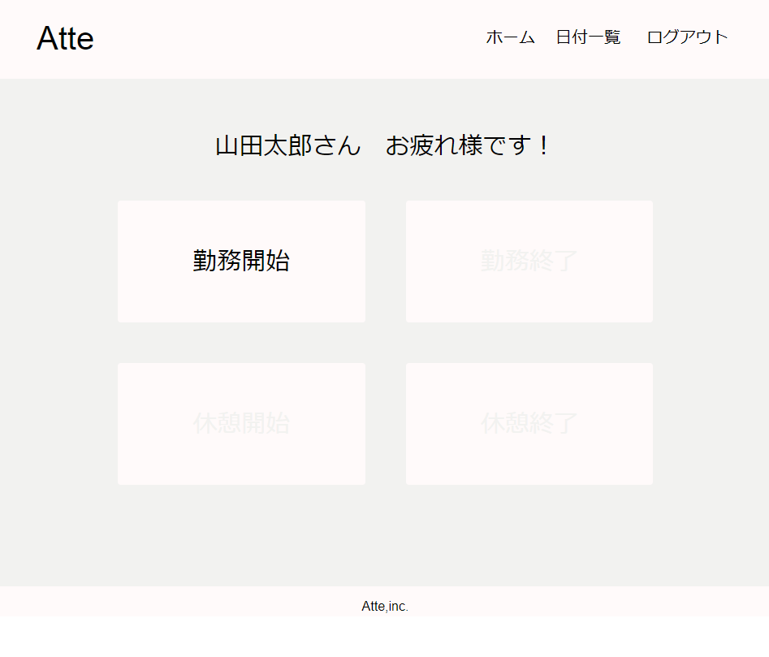
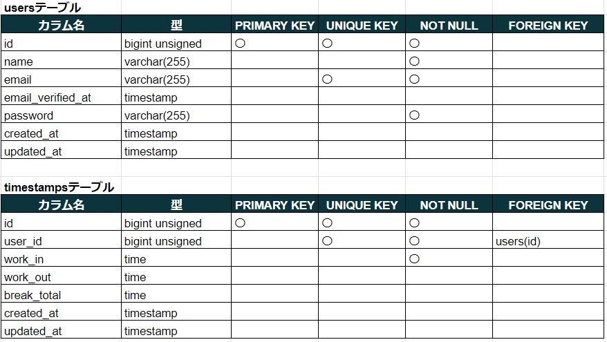
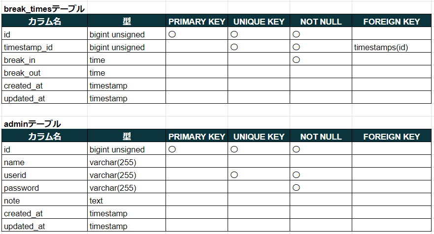
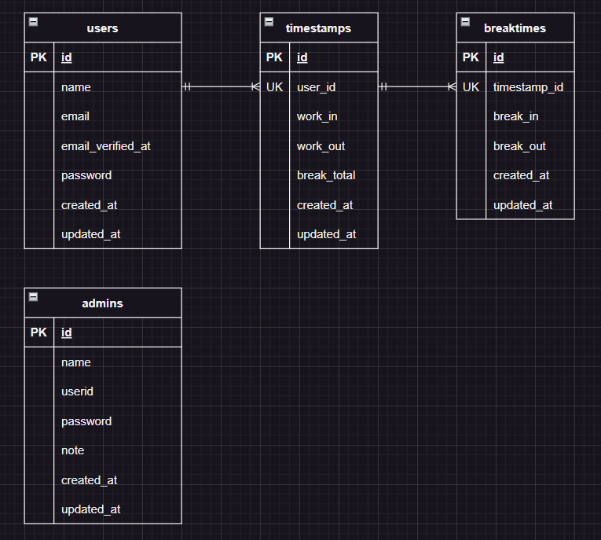

# Atte（アット）

- ある企業の勤怠管理システム
  

## 環境構築

**Docker ビルド**

1. ```bash
   git clone git@github.com:yoshikiakazawa/atte_practice.git
   ```
2. DockerDesktop アプリを立ち上げる
3. ```bash
   docker-compose up -d --build
   ```

> _Mac の M1・M2 チップの PC の場合、`no matching manifest for linux/arm64/v8 in the manifest list entries`のメッセージが表示されビルドができないことがあります。
> エラーが発生する場合は、docker-compose.yml ファイルの「mysql」内に「platform」の項目を追加で記載してください_

```bash
mysql:
    platform: linux/x86_64(この文追加)
    image: mysql:8.0.37
    environment:
```

**Laravel 環境構築**

1. ```bash
   docker-compose exec php bash
   ```
2. ```bash
   composer install
   ```

3. 「.env.example」ファイルを 「.env」ファイルに命名を変更。または、新しく.env ファイルを作成

```bash
cp .env.example .env
```

4. .env に以下の環境変数を追加

```text
DB_CONNECTION=mysql
DB_HOST=mysql
DB_PORT=3306
DB_DATABASE=laravel_db
DB_USERNAME=laravel_user
DB_PASSWORD=laravel_pass
```

5. アプリケーションキーの作成

```bash
php artisan key:generate
```

6. マイグレーションの実行

```bash
php artisan migrate
```

### テスト用ダミーデータ

```bash
php artisan db:seed
```

- テスト用ユーザー 10 人
- password:12345678 共通
- 2024/4/20 ～ 5/19 までのサンプルデータ作成 300 件

## 使用技術(実行環境)

- PHP8.3.0
- Laravel8.83.27
- MySQL8.0.37

## テーブル設計




## ER 図



## URL

- 開発環境：http://localhost/
- phpMyAdmin:：http://localhost:8080/
